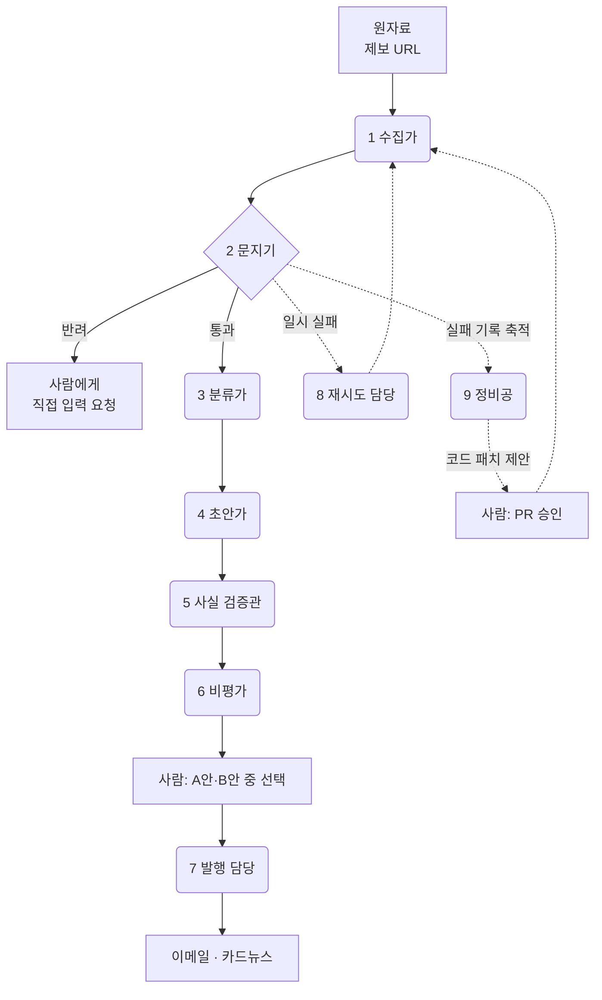

# 전담 편집 인력 없이 매주 뉴스레터를 발행하는 AI 에이전트

소셜섹터 뉴스레터 [**오렌지레터**](https://orangeletter.stibee.com)를 매주 만드는 데 실제로 쓰고 있는 에이전트 구성입니다.
편집 인력을 한 명도 두지 않고, 대신 **서브에이전트 9명**이 수집부터 발행까지 나눠 맡습니다.

> **SOVAC 2026 AX 특별전 '임팩트 스킬 허브'** 공유본입니다.
> 관람객이 자기 조직에 그대로 옮길 수 있도록, 오렌지레터 전용 로직은 걷어내고 **판단 기준과 구조만** 남겼습니다.

### ▶ 읽기 전에 돌려보세요 — **[QUICKSTART.md](QUICKSTART.md)**

**Node.js 18 이상만 있으면 됩니다.** `npm install` 없고, API 키도 데이터베이스도 없습니다.
예제 두 개가 들어 있어서 인터넷 없이도 60초 안에 문지기가 빈 게시판을 막아내는 걸 볼 수 있습니다.

```bash
git clone https://github.com/myorange-io/weekly-newsletter-agent && cd weekly-newsletter-agent
node scripts/collect.mjs examples/empty-board.html --id 시험 && node scripts/gate.mjs 시험
```

---

## 왜 한 명이 아니라 아홉 명인가

"뉴스레터 만들어줘"라고 한 번에 시키면 그럴듯한 결과가 나옵니다. 매주 시키면 무너집니다.

- 빈 페이지를 읽고도 **존재하지 않는 재단 이름을 지어냅니다**
- 지난주에 고쳐준 말투를 이번 주에 다시 틀립니다
- 자기가 쓴 문장을 검수시키면 **전부 통과시킵니다**

이 세 가지는 프롬프트를 길게 써서 해결되지 않습니다. **일을 쪼개고, 쪼갠 자리마다 다른 판단 기준을 두어야** 해결됩니다.
이 저장소는 그 경계를 어디에 그었는지에 대한 기록입니다.

---

## 전체 지도



## 아홉 명

| # | 에이전트 | 맡는 판단 | 무엇이 실행하나 |
|---|---|---|---|
| 1 | [수집가](agents/01-collector.md) | 어떤 형태의 원자료든 본문을 확보한다 | `scripts/collect.mjs` |
| 2 | [문지기](agents/02-gatekeeper.md) | **이건 AI에 넣지 않는다** — 사유를 붙여 반려 | `scripts/gate.mjs` |
| 3 | [분류가](agents/03-classifier.md) | 닫힌 분류 체계 중 어디인가, 날짜는 언제인가 | **AI** |
| 4 | [초안가](agents/04-drafter.md) | 우리 조직 문체로 초안을 쓴다 | **AI** + `scripts/format.mjs` |
| 5 | [사실 검증관](agents/05-fact-checker.md) | 초안 속 고유명사·날짜가 원문에 실재하는가 | `scripts/verify.mjs` (+AI) |
| 6 | [비평가](agents/06-critic.md) | 초안의 문제를 지적하고 대안을 낸다 | **AI** |
| 7 | [발행 담당](agents/07-publisher.md) | 확정 원고를 채널별 포맷으로 바꾼다 | `scripts/publish.mjs` |
| 8 | [재시도 담당](agents/08-retrier.md) | **기다리면 되는가** — 일시 실패를 시간으로 살린다 | `scripts/retry.mjs` |
| 9 | [정비공](agents/09-maintainer.md) | **코드를 고쳐야 하는가** — 진단하고 패치를 제안한다 | `scripts/triage.mjs` (+AI) |

여기에 요청을 분류해 라우팅하는 [오케스트레이터](agents/00-orchestrator.md)가 하나 더 있습니다.

**아홉 중 AI가 판단하는 건 셋뿐입니다.** 나머지는 코드가 합니다 — 그게 의도입니다.
기계로 끝나는 판정을 AI에게 맡기면 열 번에 한두 번 틀리고, 왜 틀렸는지도 알 수 없습니다.

> **아홉 명 = 아홉 번의 호출이 아닙니다.** 오렌지레터 실제 운영에서는 **분류가와 초안가가 한 번의 호출로 돕니다.**
> 나눈 건 개념이지 호출이 아닙니다. 어디를 합쳐도 되고 어디는 절대 안 되는지 → [PORTING.md](PORTING.md#그럼-언제-합쳐도-되나)

### 여기 없는 자리

**여는 글(인트로)은 이 구성에 들어 있지 않습니다. 사람이 통째로 씁니다.**
빠뜨린 게 아니라 두지 않기로 한 자리입니다 — 여는 글은 조직의 목소리라서,
여기까지 자동화하면 매주 비슷한 글이 나오고 읽는 사람이 먼저 알아챕니다.

---

## 실제로 이만큼 돌아갑니다

최근 한 달(2026-07-13 ~ 08-12) 기준입니다.

| | |
|---|---|
| 처리한 제보 | **566건** |
| AI 분류·초안 생성 | **512건** |
| 문지기가 반려 | **8건** |
| 사실 검증 | 512건 전수 대조 (차단 건수는 집계 안 함 — [왜](agents/05-fact-checker.md)) |
| 발행 | 이메일 6주 연속 · 카드뉴스 2회 |
| 정비공 주간 진단 | **4회** (12주 연속 무중단) |

---

## 어디서부터 시작하나 — 최소 구성 3명

아홉 명을 한 번에 만들 필요는 없습니다. **문지기 → 초안가 → 사실 검증관** 셋만 있어도
"AI가 지어내지 않고 우리 말투로 쓰는" 상태에 도달합니다. 나머지는 필요해질 때 붙이면 됩니다.

늘리는 순서와 그 이유는 [PORTING.md](PORTING.md)에 있습니다.

## 갈아끼울 자리는 셋뿐

| 축 | 고칠 파일 | 오렌지레터 | 당신의 조직이라면 |
|---|---|---|---|
| 어떤 **원자료** | [`config/gate.json`](config/gate.json) | 제보받은 웹페이지 URL | 사업 보고서 · 설문 응답 · 회의록 |
| 어떤 **문체** | [`config/voice-rules.md`](config/voice-rules.md) | 소셜섹터 뉴스레터 링크 문장 | 보도자료 · 후원자 편지 · 사업계획서 |
| 어떤 **채널** | [`scripts/publish.mjs`](scripts/publish.mjs) | 이메일 + 카드뉴스 | 블로그 · 카카오 채널 · 사내 공지 |

여기에 분류 체계([`config/categories.md`](config/categories.md))까지 넷을 고치면 대체로 돕니다.
`voice-rules.md`는 **일부러 비워뒀습니다** — 조직의 말투는 우리 것을 베껴선 안 되니까요. 채우는 양식만 들어 있습니다.

---

## 어떻게 쓰나

- **그냥 돌려보려면** — [QUICKSTART.md](QUICKSTART.md). 클론하고 명령 두 줄이면 됩니다.
- **Claude Code · Cursor를 쓴다면** — `.claude/agents/`에 아홉 명이 이미 정의돼 있습니다. 클론한 폴더를 열면 바로 잡힙니다.
  자기 프로젝트로 옮기려면 `.claude/agents/` · `scripts/` · `config/`를 통째로 복사하세요.
- **ChatGPT · Claude 웹만 쓴다면** — `.claude/agents/*.md`의 절차와 '지킬 것'을 그대로 프롬프트에 붙입니다.
  **한 번에 한 명씩** 부르는 게 핵심이고, 초안가와 비평가는 **반드시 대화창을 새로 열어야** 합니다.
- **다른 언어로 옮긴다면** — `scripts/`는 의존성이 없는 200줄 안팎의 파일들입니다. 판단 기준이 곧 분기 조건입니다.

### 저장소 구조

```
agents/       판단 기준 — 사람이 읽는 설계도 (이 저장소의 본문)
.claude/agents/  실행 정의 — 위 설계도를 가리키는 얇은 래퍼
scripts/      결정론적 부분. 의존성 없음
config/       갈아끼우는 자리
examples/     인터넷 없이 돌려볼 예제 두 개
work/         실행하면 여기 쌓입니다 (데이터베이스 대신)
```

## 먼저 읽어야 할 것

**[PORTING.md](PORTING.md)** — 일을 어디서 잘라야 하는지에 대한 규칙 4개입니다.
이 저장소에서 가장 중요한 문서이고, 에이전트 정의보다 이게 먼저입니다.

---

## 만든 곳

[마이오렌지](https://myorange.io) · [오렌지레터](https://orangeletter.stibee.com)

아홉 명 모두 클론한 자리에서 바로 돌아갑니다. 다만 **오렌지레터의 실제 운영본은 아닙니다** —
실제 구현에는 조직 고유의 데이터·인증·운영 설정이 얽혀 있어 그대로 공개하지 않았고,
여기 있는 건 같은 판단 기준을 의존성 없이 다시 짠 것입니다. 특히 이런 것들이 빠져 있습니다.

- **본문 추출이 단순합니다.** 정규식으로 태그를 걷어내는 수준이라, 사이트별 전용 추출 경로가 없습니다
- **채널 인증·API 연동이 없습니다.** "채널이 받을 수 있는 형태"까지만 만듭니다
- **문체 규칙이 비어 있습니다.** 우리 규칙을 넣으면 실제 제보 문장이 딸려 나오므로 양식만 뒀습니다

쓰다가 막히는 지점이나 자기 조직에 옮긴 사례가 있다면 이슈로 남겨주세요.
