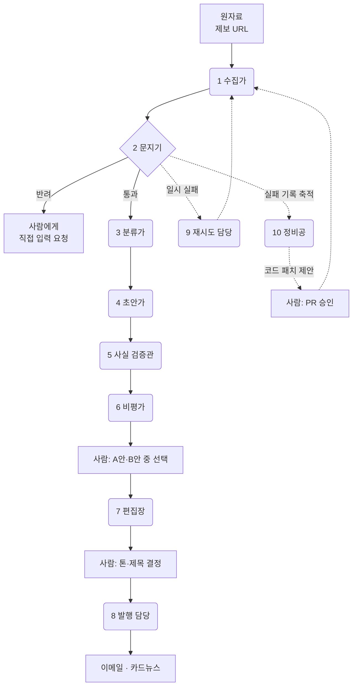

# 전담 편집 인력 없이 매주 뉴스레터를 발행하는 AI 에이전트

소셜섹터 뉴스레터 [**오렌지레터**](https://orangeletter.stibee.com)를 매주 만드는 데 실제로 쓰고 있는 에이전트 구성입니다.
편집 인력을 한 명도 두지 않고, 대신 **서브에이전트 10명**이 수집부터 발행까지 나눠 맡습니다.

> **SOVAC 2026 AX 특별전 '임팩트 스킬 허브'** 공유본입니다.
> 관람객이 자기 조직에 그대로 옮길 수 있도록, 오렌지레터 전용 로직은 걷어내고 **판단 기준과 구조만** 남겼습니다.

---

## 왜 한 명이 아니라 열 명인가

"뉴스레터 만들어줘"라고 한 번에 시키면 그럴듯한 결과가 나옵니다. 매주 시키면 무너집니다.

- 빈 페이지를 읽고도 **존재하지 않는 재단 이름을 지어냅니다**
- 지난주에 고쳐준 말투를 이번 주에 다시 틀립니다
- 자기가 쓴 문장을 검수시키면 **전부 통과시킵니다**

이 세 가지는 프롬프트를 길게 써서 해결되지 않습니다. **일을 쪼개고, 쪼갠 자리마다 다른 판단 기준을 두어야** 해결됩니다.
이 저장소는 그 경계를 어디에 그었는지에 대한 기록입니다.

---

## 전체 지도

## 열 명

| # | 에이전트 | 맡는 판단 | 주기 |
|---|---|---|---|
| 1 | [수집가](agents/01-collector.md) | 어떤 형태의 원자료든 본문을 확보한다 | 건별 |
| 2 | [문지기](agents/02-gatekeeper.md) | **이건 AI에 넣지 않는다** — 사유를 붙여 반려 | 건별 |
| 3 | [분류가](agents/03-classifier.md) | 닫힌 분류 체계 중 어디인가, 날짜는 언제인가 | 건별 |
| 4 | [초안가](agents/04-drafter.md) | 우리 조직 문체로 초안을 쓴다 | 건별 |
| 5 | [사실 검증관](agents/05-fact-checker.md) | 초안 속 고유명사·날짜가 원문에 실재하는가 | 건별 |
| 6 | [비평가](agents/06-critic.md) | 초안의 문제를 지적하고 대안을 낸다 | 요청 시 |
| 7 | [편집장](agents/07-editor-in-chief.md) | 이번 회차 여는 글의 **선택지**를 낸다 | 회차별 |
| 8 | [발행 담당](agents/08-publisher.md) | 확정 원고를 채널별 포맷으로 바꾼다 | 회차별 |
| 9 | [재시도 담당](agents/09-retrier.md) | **기다리면 되는가** — 일시 실패를 시간으로 살린다 | 1시간 |
| 10 | [정비공](agents/10-maintainer.md) | **코드를 고쳐야 하는가** — 진단하고 패치를 제안한다 | 주 1회 |

여기에 요청을 분류해 라우팅하는 [오케스트레이터](agents/00-orchestrator.md)가 하나 더 있습니다.

---

## 실제로 이만큼 돌아갑니다

최근 한 달(2026-07-13 ~ 08-12) 기준입니다.

| | |
|---|---|
| 처리한 제보 | **566건** |
| AI 분류·초안 생성 | **512건** |
| 문지기가 반려 | **8건** |
| 사실 검증 통과 | **512건 전수** |
| 여는 글 작성 | **5회차** |
| 발행 | 이메일 6주 연속 · 카드뉴스 2회 |
| 정비공 주간 진단 | **4회** (12주 연속 무중단) |

---

## 어디서부터 시작하나 — 최소 구성 3명

열 명을 한 번에 만들 필요는 없습니다. **문지기 → 초안가 → 사실 검증관** 셋만 있어도
"AI가 지어내지 않고 우리 말투로 쓰는" 상태에 도달합니다. 나머지는 필요해질 때 붙이면 됩니다.

늘리는 순서와 그 이유는 [PORTING.md](PORTING.md)에 있습니다.

## 갈아끼울 자리는 셋뿐

| 축 | 오렌지레터 | 당신의 조직이라면 |
|---|---|---|
| 어떤 **원자료** | 제보받은 웹페이지 URL | 사업 보고서 · 설문 응답 · 현장 사진 · 회의록 |
| 어떤 **문체** | 소셜섹터 뉴스레터 링크 문장 | 보도자료 · 후원자 편지 · 사업계획서 |
| 어떤 **채널** | 이메일 + 인스타그램 카드뉴스 | 블로그 · 카카오 채널 · 사내 공지 |

나머지 여덟 자리는 그대로 두고 이 셋만 바꾸면 대체로 돕니다.

---

## 어떻게 쓰나

에이전트 정의는 전부 마크다운 파일입니다. 특정 도구에 묶여 있지 않습니다.

- **Claude Code · Cursor 등을 쓴다면** — `agents/` 안의 파일을 `.claude/agents/`로 복사하고 축 3개를 고칩니다.
- **ChatGPT · Claude 웹만 쓴다면** — 각 파일의 `## 판단 기준`과 `## 출력 형식`을 그대로 프롬프트에 붙여 씁니다. 한 번에 한 명씩 부르는 게 핵심입니다.
- **코드로 옮긴다면** — 각 파일의 판단 기준이 곧 분기 조건입니다.

## 먼저 읽어야 할 것

**[PORTING.md](PORTING.md)** — 일을 어디서 잘라야 하는지에 대한 규칙 4개입니다.
이 저장소에서 가장 중요한 문서이고, 에이전트 정의보다 이게 먼저입니다.

---

## 만든 곳

[마이오렌지](https://myorange.io) · [오렌지레터](https://orangeletter.stibee.com)

이 저장소는 설계도이지 실행 코드가 아닙니다. 실제 구현에는 조직 고유의 데이터·인증·운영 설정이 얽혀 있어 그대로 공개하지 않았습니다.
쓰다가 막히는 지점이나 자기 조직에 옮긴 사례가 있다면 이슈로 남겨주세요.
